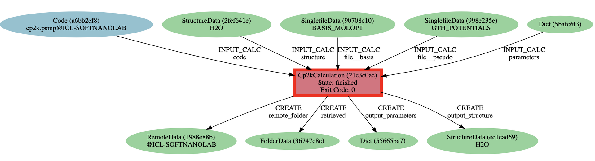
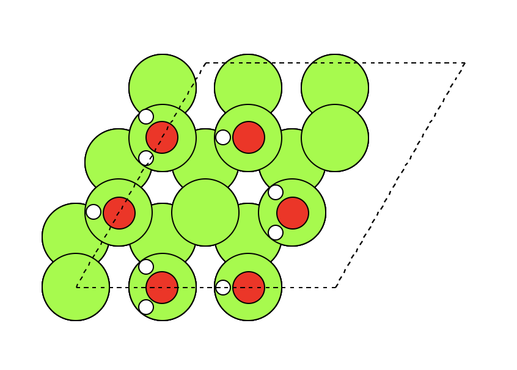

AiiDA_running_CP2K

# Running CP2K using AiiDA

* <span style=color:red>This note gives some basic indications on how to run cp2k calculations via aiida.</span>

## Setting up a new cp2k code
* To set up a new cp2k code in the aiida, run the following command:
  ```console
   $ verdi code setup --label cp2k --computer <name_of_computer> --remote-abs path <absolute_path_of_cp2k_code> --input-plugin cp2k --non-interactive
   ```
   
* If the setup is sucessful, you should be able to see this new code when execute <span style="color:pink">verdi code list</span>.
  

## Structure and Pseudopotential
* The first step is to import a structure from a file into the AiiDA database. To download the example water molecule structure from the github, you can just use <span style="color:pink">wget</span>:

  ```{code-block} bash
  $ wget https://raw.githubusercontent.com/aiidateam/aiida-cp2k/develop/examples/files/h2o.xyz
  ```
* Then import the downloaded structure into your database:
  ```{code-block} console
  $ verdi data structure import ase h2o.xyz
  ```
* To check the PK of the imported structure in the database, you can just look for it through the following command:

  ```{code-block} console
  $ verdi data structure list
  ```
  Then you can find the PK of the imported structure shown in the column of ID. 
  
* After imported the structure in the database, you need to import the basis set file (Gaussian type basis set) and the pseudopotential file into your data base.

* Firstly, you need to download the basis set/pseudopotential file from the website or copy these files from your CP2K packages. 

  ```{code-block} console
  $ wget https://raw.githubusercontent.com/aiidateam/aiida-cp2k/develop/examples/files/BASIS_MOLOPT
  ```
  ```{code-block} console
  $ wget https://raw.githubusercontent.com/aiidateam/aiida-cp2k/develop/examples/files/GTH_POTENTIALS
  ```
  
* Then you need to add the basis set/pseudopotential file into the database. You need to turn on the aiida environment (Python ORM) using `$ verdi shell`  and then load the file reader module in adiida:

  ```{code-block} ipython
  In [1]: from aiida.orm import SinglefileData
  ```
  
  After these preparations, then you can upload the basis set/pseudopotential file into the database:
  
  ```{code-block} ipython
  In [2]: basis_file = SinglefileData('<abs_path_of_file>')
  
  In [3]: pseudo_file = SinglefileData('<abs_path_of_file>')
  ```
  
* The next step is to set the parameters for the calculation (here we run a simple geometry optimisation of a water molecule). 

  ```{code-block} ipython
  In [4]: parameters = Dict(
        dict={
            'GLOBAL': {
                'RUN_TYPE': 'GEO_OPT',
            },
            'FORCE_EVAL': {
                'METHOD': 'Quickstep',
                'DFT': {
                    'BASIS_SET_FILE_NAME': 'BASIS_MOLOPT',
                    'POTENTIAL_FILE_NAME': 'GTH_POTENTIALS',
                    'QS': {
                        'EPS_DEFAULT': 1.0e-12,
                        'WF_INTERPOLATION': 'ps',
                        'EXTRAPOLATION_ORDER': 3,
                    },
                    'MGRID': {
                        'NGRIDS': 4,
                        'CUTOFF': 280,
                        'REL_CUTOFF': 30,
                    },
                    'XC': {
                        'XC_FUNCTIONAL': {
                            '_': 'PBE',
                        },
                    },
                    'POISSON': {
                        'PERIODIC': 'none',
                        'PSOLVER': 'MT',
                    },
                },
                'SUBSYS': {
                    'KIND': [
                        {
                            '_': 'O',
                            'BASIS_SET': 'DZVP-MOLOPT-SR-GTH',
                            'POTENTIAL': 'GTH-PBE-q6'
                        },
                        {
                            '_': 'H',
                            'BASIS_SET': 'DZVP-MOLOPT-SR-GTH',
                            'POTENTIAL': 'GTH-PBE-q1'
                        },
                    ],
                },
            }
        }) 
	
	```
	
	
* The final step for the calculation is to set the process builder using the structure/basis set/pseudopotential and calculation parameters. 

  ```{code-block} ipython
  In [5]: code = load_code(<CODE_PK>)
  
  In [6]: builder = code.get_builder()
  
  In [7]: structure = load_node(<STRUCTURE_PK>)
  
  In [8]: builder.structure = structure
  
  In [9]: builder.parameters = parameters
  
  In [10]: builder.file = {'basis':basis_file,'pseudo':pseudo_file,}
  
  In [11]: builder.metadata.options.resources = {'num_machines': 1}
  
  In [12]: from aiida.engine import submit
      ...: calcjob_node = submit(builder)
  ```
* Finally let's exit the verdi shell using the `exit()` command and have a look at how your calculation is doing. You can check the list of process stored in your database using 
  ```{code-block} console
  $ verdi process list
  ```
 
## Exploring the results

* Use the PK of the `Cp2kCalculation` to get more information on it:

  ```{code-block} console
   $ verdi process show <PK>
  ```
  
  This will produce a lot of details on the calculation and its in- and outputs:

  ```{code-block} bash
  Property     Value
  -----------  ------------------------------------
  type         Cp2kCalculation
  state        Finished [0]
  pk           260
  uuid         21c3c0ac-e6e5-4f2f-8f17-64d46712cd35
  label
  description
  ctime        2021-07-11 11:46:14.180254+00:00
  mtime        2021-07-11 11:48:59.494365+00:00
  computer     [2] ICL-SOFTNANOLAB
  
  Inputs      PK    Type
  ----------  ----  --------------
  file
      basis   257   SinglefileData
      pseudo  258   SinglefileData
  code        240   Code
  parameters  259   Dict
  structure   249   StructureData
  
  Outputs              PK  Type
  -----------------  ----  -------------
  output_parameters   263  Dict
  output_structure    264  StructureData
  remote_folder       261  RemoteData
  retrieved           262  FolderData
  ```
  
  
* As you can see, AiiDA has tracked all the inputs provided to the calculation, allowing you (or anyone else) to reproduce it later on.

* AiiDA’s record of a calculation is best displayed in the form of a provenance graph. You can generate one by running the following verdi command using the PK of your calculation node:

```{code-block} console
$ verdi node graph generate <PK>
```

* The command will write the provenance graph to a file named PK.dot.pdf. It should look like this:

<div style="text-align: center;"></div>


# Running your calculations

## Generating Mg (0001) surface with water bi-layer structrue

* The first step is to generate the origina structure of the whole system using ase. The code is as follows (going to the Python ORM using `$ ipython3` command):
  **Importing the package/function we need**
  ```{code-block} ipython
  In [1]: import ase
        : import numpy as np
        : from ase.build import hcp0001,add_adsorbate
	    : from ase.io import write
	    : from ase.visualize import view
  ```
  **Building the clean Mg (0001) surface**
  ```{code-block} ipython
  In [2]: Mg_0001 = hcp0001('Mg', size=(3,3,7), a=3.2160, c=5.2060, vacuum=10)
  ```
  
  **Adding oxygen atoms (of water molecules) on the on-top site of Mg atoms**
  ```{code-block} ipython
  In [3]: offset=((0,1),(0,2),(1,2),(2,1),(2,0),(1,0))
        : distance = 3
	    : for i in range(len(offset)):
              add_adsorbate(Mg_0001,'O',distance,'ontop',offset[i])
	    : atom_number = len(Mg_0001.get_positions())
  ```
  
  **Adding the H (downwards to the surface) atoms**
  ```{code-block} ipython
  In [4]: OH_bond = 0.96
        : H1_abs = Mg_0001.get_positions()[63] + (-OH_bond,0,0)
        : H3_abs = Mg_0001.get_positions()[65] + (-OH_bond,0,0)
        : H5_abs = Mg_0001.get_positions()[67] + (-OH_bond,0,0)     
        : Mg_0001.append(Atom('H',H1_abs))
        : Mg_0001.append(Atom('H',H3_abs))
        : Mg_0001.append(Atom('H',H5_abs))
  ```
  
  **Adding the other H atoms (belongs to the downwards-H water molecules) on the water molecules**
  ```{code-block} ipython
  In [5]: alpha = 104.5 / 180 * np.pi
        : beta = alpha - (np.pi/2)
	    : dx =   OH_bond * np.sin(beta)
        : dz = - OH_bond * np.cos(beta)
        : dy = 0
	    : H1_prime_abs = Mg_0001.get_positions()[63] + (dx,dy,dz)
        : H3_prime_abs = Mg_0001.get_positions()[65] + (dx,dy,dz)
        : H5_prime_abs = Mg_0001.get_positions()[67] + (dx,dy,dz)
	    : Mg_0001.append(Atom('H',H1_prime_abs))
        : Mg_0001.append(Atom('H',H3_prime_abs))
        : Mg_0001.append(Atom('H',H5_prime_abs))
  ```
  
  **Adding water moelcules whose molecular plane is parallel to the surface**
    ```{code-block} ipython
	In [6]: dxx = -OH_bond * np.cos(alpha/2)
          : dzz = 0
          : dyy = OH_bond * np.sin(alpha/2)
		  : H2_prime1_abs = Mg_0001.get_positions()[64] + (dxx,+dyy,dzz)
          : H2_prime2_abs = Mg_0001.get_positions()[64] + (dxx,-dyy,dzz)
		  : Mg_0001.append(Atom('H',H2_prime1_abs))
          : Mg_0001.append(Atom('H',H2_prime2_abs)) 
		  : H4_prime1_abs = Mg_0001.get_positions()[66] + (dxx,+dyy,dzz)
          : H4_prime2_abs = Mg_0001.get_positions()[66] + (dxx,-dyy,dzz)
		  : Mg_0001.append(Atom('H',H4_prime1_abs))
          : Mg_0001.append(Atom('H',H4_prime2_abs))
		  : H6_prime1_abs = Mg_0001.get_positions()[68] + (dxx,+dyy,dzz)
          : H6_prime2_abs = Mg_0001.get_positions()[68] + (dxx,-dyy,dzz)
		  : Mg_0001.append(Atom('H',H6_prime1_abs))
          : Mg_0001.append(Atom('H',H6_prime2_abs))
	```
	
	**Building a symmatric slab with water bi-layer adsorbed on both side**
	
	```{code-block} ipython
	In [7]: c = Mg_0001.get_cell()[2][2] / 2
	      : for i in range(63,69):
                O_abs = Mg_0001.get_positions()[i] + (0,0,2*c -  2*Mg_0001.get_positions()[i][2])
                Mg_0001.append(Atoms('O',O_abs))
          : for i in range(69,81):
                H_abs = Mg_0001.get_positions()[i] + (0,0,2*c - 2*Mg_0001.get_positions()[i][2])
                Mg_0001.append(Atoms('H',H_abs))
	```
	
	**Viewing the generated structure**
	```{code-block} ipython
	In [8]: view(Mg_0001)
	```
	
	You will find a pattern of the generated structure from the top-view looks like this:
	<div style="text-align: center;"></div>
	
	**Outputting the built structure**
	```{code-block} ipython
	In [9]: write('Mg_0001_water_bilayer.vasp', Mg_0001)
	      : with open("Mg_0001_water_bilayer.vasp", "r") as f:
          :     contents = f.readlines()
          : value = contents[0]
          : contents.insert(5, value)

          : with open("Mg_0001_water_bilayer.vasp", "w") as f:
          :     contents = "".join(contents)
          : f.write(contents)
	```
	
	
## Doing geometry optimisation using cp2k-aiida 
* First upload the slab structure into the database using the following command:

  ```{code-block} console
  $ verdi data structure import ase Mg_0001_water_bilayer.vasp
  ```
  
* Then add the basis set and pseudopotential file into the database through the following command in the Python ORM `$ verdi shell`:

  ```{code-block} ipython
  In [1]: from aiida.orm import SinglefileData
  ```
 
  ```{code-block} ipython
  In [2]: basis_file = SinglefileData('<abs_path_of_file>')
  
  In [3]: pseudo_file = SinglefileData('<abs_path_of_file>')
  
  In [4]: structure = load_node(<STRUCTURE_PK>)
  ```
  
* The next step is to set the parameters for the geometry optimisation:

  ```{code-block} ipython
  In [5]: parameters = Dict(
        dict={
            'GLOBAL': {
                'RUN_TYPE': 'GEO_OPT',
                'PROJECT' : 'Mg_0001',
                'PRINT_LEVEL': 'MEDIUM',
            },
            'MOTION': {
                'GEO_OPT': {
                    'OPTIMIZER': 'BFGS',
                },
            },
            'FORCE_EVAL': {
                'METHOD': 'Quickstep',
                'DFT': {
                    'BASIS_SET_FILE_NAME': 'BASIS_MOLOPT',
                    'POTENTIAL_FILE_NAME': 'GTH_POTENTIALS',
                    'QS': {
                        'EPS_DEFAULT': 1.0e-12,
                        'EXTRAPOLATION_ORDER': 3,
                    },
			  'KPOINTS':{
			      'SYMMETRY': '.TRUE.',
			      'SCHEME': 'MONKHORST-PACK 7 7 1',
			  },
                    'MGRID': {
                        'NGRIDS': 4,
                        'CUTOFF': 400,
                        'REL_CUTOFF': 60,
                    },
                    'XC': {
                        'XC_FUNCTIONAL': {
                            '_': 'PBE',
                        },
                    },
                    'SCF': {
                        'SCF_GUESS': 'ATOMIC',
                        'EPS_SCF':  1.0E-8,
                        'MAX_SCF':  300,
                        'ADDED_MOS': 20,
                        'DIAGONALIZATION': {
                            'ALGORITHM': 'STANDARD',
                        },
                        'MIXING': {
                            'METHOD': 'BROYDEN_MIXING',
                            'ALPHA': 0.3,
                            'NBROYDEN': 8,
                        },
                        'SMEAR': {
                            'METHOD': 'FERMI_DIRAC',
                            'ELECTRONIC_TEMPERATURE': 157.9
                        },
                        'PRINT': {
                            'RESTART': {
                                '_': 'ON'
                            }
                        }
                    },
                },
                'SUBSYS': {
                    'CELL': {
                        'A': '9.6479999999999997    0.0000000000000000    0.0000000000000000',
                        'B': '4.8239999999999998    8.3554130957122652    0.0000000000000000',
                        'C': '0.0000000000000000    0.0000000000000000   35.6179999999999950',
                    },
                    'KIND': [
                        {
                            '_': 'O',
                            'BASIS_SET': 'TZV2P-MOLOPT-GTH-q6',
                            'POTENTIAL': 'GTH-PBE-q6'
                        },
                        {
                            '_': 'H',
                            'BASIS_SET': 'TZV2P-MOLOPT-GTH-q1',
                            'POTENTIAL': 'GTH-PBE-q1'
                        },
                        {
                            '_': 'Mg',
                            'BASIS_SET': 'rc-7pt5-sspd+s-single-exp-atom-opt',
                            'POTENTIAL': 'GTH-PBE-q2'
                        },						
                    ],
                },
                'PRINT': { 
                    'FORCES': {
                        '_': 'ON',
                    }
                },
            }
        })
  ```
  

* The final step for the calculation is to set the process builder using the structure/basis set/pseudopotential and calculation parameters. 

  ```{code-block} ipython
  In [5]: code = load_code(<CODE_PK>)
  
  In [6]: builder = code.get_builder()
  
  In [7]: structure = load_node(<STRUCTURE_PK>)
  
  In [8]: builder.structure = structure
  
  In [9]: builder.parameters = parameters
  
  In [10]: builder.file = {'basis':basis_file,'pseudo':pseudo_file,}
  
  In [11]: builder.metadata.options.resources = {'num_machines': 1}
  
  In [12]: from aiida.engine import submit
      ...: calcjob_node = submit(builder)
  ```

* Finally let's exit the verdi shell using the `exit()` command and have a look at how your calculation is doing. You can check the list of process stored in your database using 
  ```{code-block} console
  $ verdi process list
  ```
   You can see the status of the submitted calculation work as follows:
   
  ```{code-block} console
    PK  Created    Process label    Process State    Process status
    ----  ---------  ---------------  ---------------  ---------------------------------------
    287  38m ago    Cp2kCalculation  ⏵ Waiting        Monitoring scheduler: job state RUNNING

    Total results: 1

    Info: last time an entry changed state: 37m ago (at 09:41:05 on 2021-07-13)
  ```
  
* Once the calculation is finished, you can use `$ verdi process show <PK>` to check more detailed information of the calculation:

  ```{code-block} console
  Property     Value
  -----------  ------------------------------------
  type         Cp2kCalculation
  state        Finished [0]
  pk           287
  uuid         98eaa70c-fcf3-4313-84b1-9213b7a0e360
  label
  description
  ctime        2021-07-13 09:40:02.726826+00:00
  mtime        2021-07-13 12:05:52.597851+00:00
  computer     [2] ICL-SOFTNANOLAB
  
  Inputs      PK    Type
  ----------  ----  --------------
  file
      basis   284   SinglefileData
      pseudo  285   SinglefileData
  code        240   Code
  parameters  286   Dict
  structure   277   StructureData
  
  Outputs              PK  Type
  -----------------  ----  -------------
  output_parameters   290  Dict
  output_structure    291  StructureData
  remote_folder       288  RemoteData
  retrieved           289  FolderData
  
  Log messages
  ---------------------------------------------
  There are 6 log messages for this calculation
  Run 'verdi process report 287' to see them
  ```
  
* The total energy of the optimised structure is contained in the `output_parameters` and can be retrieved following these procedures:

  ```{code-block} ipython
  In [1]: node = load_node(<PK_output_parameters>)
  
  In [2]: total_energy = node.get_dict()['energy']
  ```
  
* You can also retrieve the structure of the optimised slab using a similar method by loading the information conatins in the `output_structure`:

  ```{code-block} ipython
  In [1]: node = load_node(<PK_output_structure>)
  
  In [2]: node.get_ase().write('optimised_structure.xyz') 
  ```
